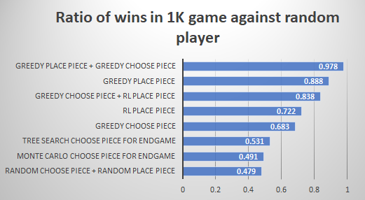
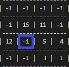

# Mastering Quarto
In this project, we aim to create a powerful AI player for the game of Quarto by leveraging a combination of reinforcement learning and heuristic strategies. Quarto is a strategic board game that presents unique challenges in terms of decision-making and pattern recognition. Our goal is to develop algorithms that can not only compete against human players but consistently win the game.

## Team
Zohreh Lahijaniamiri (s300451) responsibilities:
- Greedy algorithm for place piece
- Greedy algorithm for choose piece

Shayan Taghinezhad Roudbaraki (s301425) responsibilities:
- Tree search algorithm for choose piece
- Monte Carlo algorithm for choose piece
- Reinforcement Learning algorithm for place piece

We reviewed each other’s codes and suggested improvements and fixes. At the end we combined all of the algorithms in one class.

## Algorithms

### Tree search for choose piece
Here we saw that the simple tree search can take a really long time to accomplish each decision. So, generally it can be a good choice for the endgame where there are limited nodes and branches. At the end of the day, it didn’t show a good enough performance for our agent.

### Monte Carlo algorithm for choose piece
During our research, we found out the Monte Carlo is one of the main algorithms that are used nowadays for decision making in the games, especially in computer-based board games. However, after implementing a simple version of Monte Carlo, we didn’t get a good performance out of it.

### Greedy choose piece
This algorithm tries to find pieces that doesn’t result in an instant loss for our agent. This greedy algorithm has a much better performance and wins about 68% of the games against random player.

### Reinforcement Learning agent for place piece
We also worked on a reinforcement learning agent or placing the piece. The main challenge was selecting a good enough board state without making trillions of possible states and also not compressing the board state in a way that may result in losing beneficial data.
The best solutions that we found was to save the state of the board after our agent’s place piece as four subsequent states which correspond to the row and the columns which the piece was placed at plus the two diagonals of the board. At the end of this four arrays of four numbers we place another number which shows the (possible) position of the piece in that array. For example:

If we place piece #2 in column 1 of row 2 in this board:

We save four states in state history consisting of four pieces in that row/column/diagonal and the position of the placed piece in the row/column/diagonals:
- A state for the corresponding row: [12, 2, 5, 4, 1]
- A state for the corresponding column: [-1, 15, 2, -1, 2]
- A state for the main diagonal: [-1, 15, 5, 1, 2] *
- A state for the antidiagonal: [-1, 11, 2, -1, 2]

*: Note that here the placed piece is not even in the main diagonal and therefore the last number doesn’t correspond to the real state of the board. However, without making it more complicated, this simple solution works and the wrong states like this lose their significance in the final result.
This agent shows 72% win against the random player.
Greedy for choose piece + Reinforcement learning for place piece
Here we have the first combination of algorithms which is able to show a great performance in the game. This combination has 83% win against random player.

### Greedy place piece
In this algorithm, we try to find the place on the board that result in an instant win for the agent. The performance of this algorithm is surprisingly better than all other single and combined algorithms until here, with 88% win against random player.

### Winner: Greedy for place piece + Greedy for choose piece
At the end, the combination of greedy for place piece and greedy for choose piece showed the most promising results against the random player with 97% win and we chose is as the main algorithm for our agent.

### The final agent class implementation
The agent class implementation at the end has a parameter for each of these algorithms and we can enable or disable them whenever need. The winner algorithm mentioned above is enabled by default.